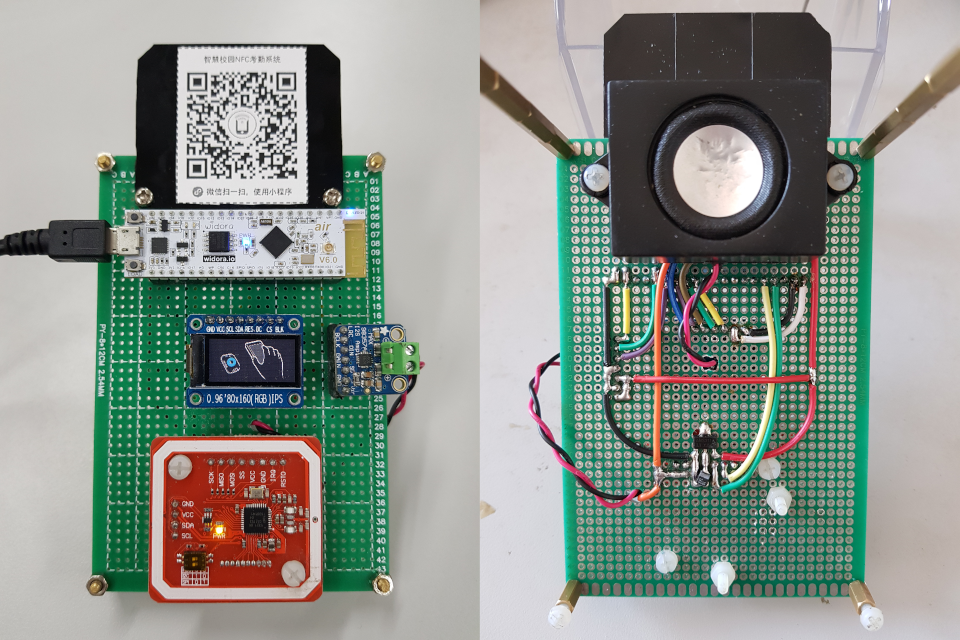

NFC Attendance System
=====================

## Main Features

* PN532 NFC-Token Exchange
* Wifi SmartConfig Support
* GIF Animations Output
* Audio Prompt (I2S output)
* OTA Firmware Update (HTTP / HTTPS)

## Repositories

* [ESP32 Core Controller](https://github.com/redchenjs/nfc_attendance_system_esp32)
* [WeChat Mini-Program](https://github.com/redchenjs/nfc_attendance_system_weixin)
* [PHP Backend Server](https://github.com/redchenjs/nfc_attendance_system_server)
* [EAGLE Schematic](https://github.com/redchenjs/nfc_attendance_system_eagle)

## Board

## Mini-Program Code

## Videos Links

* [智慧校园NFC考勤系统简介](https://www.bilibili.com/video/av64088862)
* [智慧校园NFC考勤系统配套微信小程序](https://www.bilibili.com/video/av83055533)
